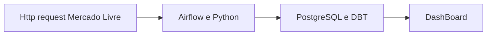
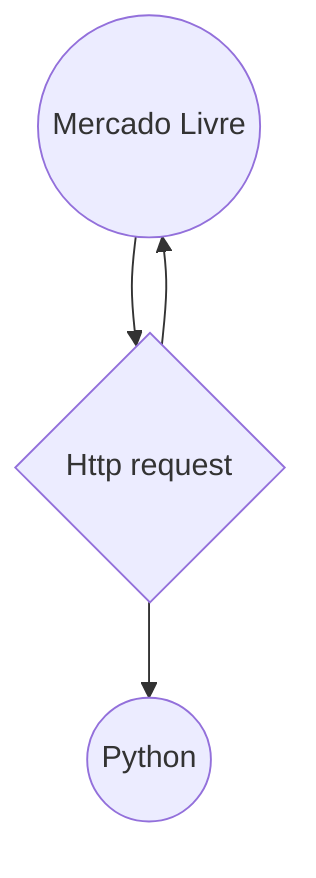
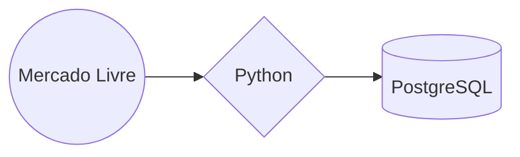
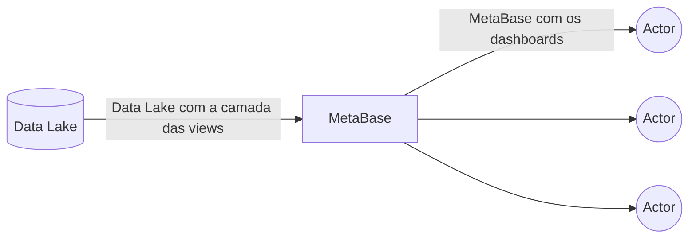

# Airflow, DBT e PostgreSQL: Uma Combinação Poderos
Esta documentação tem como objetivo demonstrar o processo de ELT utilizando ferramentas como Python, Airflow, PostgreSQL e dbt. O foco é apresentar como essas tecnologias se integram para automatizar a extração, carga e transformação de dados de forma eficiente.
<br>
### Introdução da Pipeline

O projeto será desenvolvido em quatro etapas principais:

1. **Extração**: Coletar os dados de ofertas de celulares do Mercado Livre através de requisições à API.
2. **Processamento**: Processar os dados extraídos e armazená-los em um Data Lake.
3. **Transformação**: Aplicar transformações nos dados utilizando o dbt para prepará-los para análise.
4. **Visualização**: Exibir os dados transformados em um dashboard para visualização e análise eficiente.


### HTTP Request: Extração de Dados do Mercado Livre

A extração de dados será realizada na página de ofertas diárias de celulares do Mercado Livre. Utilizaremos a biblioteca **BeautifulSoup** em Python para tratar os dados recebidos e selecionar os campos específicos do HTML.




#### Links Utilizados:
1. [Página 1 - Ofertas de Celulares](https://www.mercadolivre.com.br/ofertas?container_id=MLB779535-1&domain_id=MLB-CELLPHONES)
2. [Página 2 - Ofertas de Celulares](https://www.mercadolivre.com.br/ofertas?container_id=MLB779535-1&domain_id=MLB-CELLPHONES&page=2)
3. [Página 3 - Ofertas de Celulares](https://www.mercadolivre.com.br/ofertas?container_id=MLB779535-1&domain_id=MLB-CELLPHONES&page=3)
4. [Página 4 - Ofertas de Celulares](https://www.mercadolivre.com.br/ofertas?container_id=MLB779535-1&domain_id=MLB-CELLPHONES&page=4)
5. [Página 5 - Ofertas de Celulares](https://www.mercadolivre.com.br/ofertas?container_id=MLB779535-1&domain_id=MLB-CELLPHONES&page=5)


#### Campos a Serem Extraídos:
- **Nome do Produto:** Nome do celular ofertado.
- **Preço da Oferta:** Preço atual do produto em promoção.
- **Preço Fora da Oferta:** Preço original, sem o desconto.
- **Loja Vendedora:** Nome do vendedor responsável pela oferta.
- **Em Oferta Especial:** Indicação se o produto está em uma promoção especial.
- **Frete Full:** Verificação se o produto tem frete grátis ou entrega rápida (Frete Full).
- **Porcentagem de Desconto:** Percentual de desconto aplicado na oferta.
- **Imagem do Produto:** URL da imagem do produto ofertado.


Essa estrutura facilita o entendimento e execução do script, com todos os links e campos claramente definidos para a extração de dados.

### Código em Python para o ELT

O código abaixo é responsável por solicitar a requisição das 5 páginas de ofertas de celulares no Mercado Livre, receber os dados e tratá-los. Em seguida, esses dados são transformados nos campos específicos mencionados anteriormente.

```python
import pandas as pd
import requests
from bs4 import BeautifulSoup

# Lista de URLs das páginas a serem coletadas
urls = [
    "https://www.mercadolivre.com.br/ofertas?container_id=MLB779535-1&domain_id=MLB-CELLPHONES",
    "https://www.mercadolivre.com.br/ofertas?container_id=MLB779535-1&domain_id=MLB-CELLPHONES&page=2",
    "https://www.mercadolivre.com.br/ofertas?container_id=MLB779535-1&domain_id=MLB-CELLPHONES&page=3",
    "https://www.mercadolivre.com.br/ofertas?container_id=MLB779535-1&domain_id=MLB-CELLPHONES&page=4",
    "https://www.mercadolivre.com.br/ofertas?container_id=MLB779535-1&domain_id=MLB-CELLPHONES&page=5"
]

# Lista para armazenar as ofertas de todas as páginas
ofertas = []

# Função para identificar a marca do celular
def identificar_marca(nome_produto):
    marcas = ['Samsung', 'Motorola', 'Apple', 'Xiaomi', 'Realme', 'Multilaser']
    for marca in marcas:
        if marca.lower() in nome_produto.lower():
            return marca
    return 'Outros'

# Função para fazer scraping em uma página
def scrape_page(url):
    # Fazer a requisição da página
    response = requests.get(url)
    soup = BeautifulSoup(response.text, 'lxml')

    # Encontrar as informações de cada oferta
    produtos = soup.find_all('li', class_='promotion-item')

    # Iterar sobre cada oferta e extrair as informações desejadas
    for produto in produtos:
        # Nome do Produto
        titulo = produto.find('p', class_='promotion-item__title')
        nome_produto = titulo.text if titulo else 'N/A'

        # Identificar a marca
        marca = identificar_marca(nome_produto)

        # Preço atual
        preco_atual = produto.find('span', class_='andes-money-amount__fraction')
        preco_atual_texto = preco_atual.text if preco_atual else 'N/A'

        # Preço antigo
        preco_antigo = produto.find_all('span', class_='andes-money-amount__fraction')
        preco_antigo_texto = preco_antigo[1].text if len(preco_antigo) > 1 else 'N/A'

        # Loja Vendedora
        loja_vendedora = produto.find('span', class_='promotion-item__seller')
        loja_vendedora_texto = loja_vendedora.text if loja_vendedora else 'N/A'

        # Oferta do Dia
        oferta_do_dia = produto.find('span', class_='promotion-item__today-offer-text')
        oferta_do_dia_texto = oferta_do_dia.text if oferta_do_dia else 'SEM OFERTA DO DIA'

        # Frete Full (Verificação do SVG relacionado ao frete full)
        frete_full = produto.find('svg', class_='full-icon')
        frete_full_texto = 'FRETE FULL' if frete_full else 'SEM FRETE FULL'

        # Porcentagem de desconto
        porcentagem_desconto = produto.find('span', class_='promotion-item__discount-text')
        porcentagem_desconto_texto = porcentagem_desconto.text if porcentagem_desconto else 'SEM DESCONTO'

        # URL da Imagem do Produto
        imagem_produto = produto.find('img', class_='promotion-item__img')
        imagem_produto_url = imagem_produto['src'] if imagem_produto else 'N/A'

        # Adicionar os dados a uma lista de dicionários
        ofertas.append({
            'nome_produto': nome_produto,
            'marca': marca,
            'preco_atual': preco_atual_texto,
            'preco_antigo': preco_antigo_texto,
            'loja_vendedora': loja_vendedora_texto,
            'oferta_do_dia': oferta_do_dia_texto,
            'frete_full': frete_full_texto,
            'porcentagem_desconto': porcentagem_desconto_texto,
            'imagem_produto_url': imagem_produto_url
        })

# Loop para fazer o scraping em cada página
for url in urls:
    scrape_page(url)

# Organizar os dados em tabela usando Pandas
df_ofertas = pd.DataFrame(ofertas)
```
# Ofertas Mercado Livre - Celulares

Este documento exibe as principais ofertas de celulares disponíveis no Mercado Livre, extraindo e apresentando informações relevantes, como nome do produto, marca, preço, loja vendedora, e mais.

## Tabela de Ofertas

| **Nome do Produto**                                                                                          | **Marca**  | **Preço Atual** | **Preço Antigo** | **Loja Vendedora**   | **Oferta do Dia**     | **Frete Full**    | **Porcentagem de Desconto** | **Imagem do Produto**                                                                 |
|---------------------------------------------------------------------------------------------------------------|------------|-----------------|------------------|-----------------------|-----------------------|-------------------|----------------------------|---------------------------------------------------------------------------------------|
| Fone + Redmi 13c 256gb 8gb Ram Android 11 + Nota Fiscal                                                        | Outros     | 1.497           | 1.152            | N/A                   | SEM OFERTA DO DIA      | SEM FRETE FULL     | 23% OFF                    | [Imagem](https://http2.mlstatic.com/D_Q_NP_873961-MLB78436044206_082024-W.jpg)         |
| Samsung Galaxy Z Flip 4 5g 128gb, 8gb Ram  Excelente                                                          | Samsung    | 2.499           | 2.074            | N/A                   | SEM OFERTA DO DIA      | SEM FRETE FULL     | 17% OFF                    | [Imagem](https://http2.mlstatic.com/D_Q_NP_892393-MLB78624820171_082024-W.jpg)         |
| Celular Samsung Galaxy M35 5g , Câmera Tripla Até 50mp, Selfie 50mp, Tela Super Amoled + 6.6 120hz, 256gb, 8gb Ram - Azul Claro | Samsung    | 1.888           | 1.299            | Por Samsung           | SEM OFERTA DO DIA      | SEM FRETE FULL     | 31% OFF                    | [Imagem](https://http2.mlstatic.com/D_Q_NP_882209-MLU76405989014_052024-W.jpg)         |
| Celular Samsung Galaxy M35 5g , Câmera Tripla Até 50mp, Selfie 50mp, Tela Super Amoled + 6.6 120hz, 256gb, 8gb Ram - Cinza     | Samsung    | 1.888           | 1.299            | Por Samsung           | SEM OFERTA DO DIA      | SEM FRETE FULL     | 31% OFF                    | [Imagem](https://http2.mlstatic.com/D_Q_NP_882189-MLU76405954922_052024-W.jpg)         |
| Motorola Moto G85 5G 256GB Grafite 16GB RAM Boost                                                              | Motorola   | 2.299           | 1.709            | Por Motorola          | OFERTA DO DIA          | FRETE FULL         | 25% OFF no PIX             | [Imagem](https://http2.mlstatic.com/D_Q_NP_796103-MLU78093634301_072024-W.jpg)         |
| Motorola Moto G54 5G 256 GB Azul 8 GB RAM                                                                      | Motorola   | 1.899           | 1.149            | Por Mega Mamute       | SEM OFERTA DO DIA      | FRETE FULL         | 39% OFF                    | [Imagem](https://http2.mlstatic.com/D_Q_NP_790094-MLU78394982184_082024-W.jpg)         |
| Motorola Moto G84 5G 256 GB Grafite 8 GB RAM                                                                   | Motorola   | 2.331           | 1.498            | Por Mega Mamute       | SEM OFERTA DO DIA      | FRETE FULL         | 35% OFF                    | [Imagem](https://http2.mlstatic.com/D_Q_NP_902597-MLU77144155768_062024-W.jpg)         |
| Motorola Moto G85 5G 256GB Azul Vegan Leather 16GB RAM Boost                                                   | Motorola   | 2.299           | 1.709            | Por Motorola          | OFERTA DO DIA          | FRETE FULL         | 25% OFF no PIX             | [Imagem](https://http2.mlstatic.com/D_Q_NP_998515-MLU77871522886_072024-W.jpg)         |
| Motorola Edge 40 Neo 5G Dual SIM 256 GB Black beauty 8 GB RAM                                                  | Motorola   | 2.799           | 1.871            | Por Motorola          | SEM OFERTA DO DIA      | FRETE FULL         | 33% OFF no PIX             | [Imagem](https://http2.mlstatic.com/D_Q_NP_881477-MLA74650874883_022024-W.jpg)         |
| Realme C53 (50 Mpx) Dual SIM 128 GB mighty black 6 GB RAM                                                      | Realme     | 1.628           | 809              | Por Realme            | OFERTA DO DIA          | FRETE FULL         | 50% OFF                    | [Imagem](https://http2.mlstatic.com/D_Q_NP_742601-MLU77356289551_062024-W.jpg)         |
| Samsung Galaxy A15 5G 5G 256 GB azul-escuro 8 GB RAM                                                           | Samsung    | 1.898           | 1.249            | Por Vikings           | OFERTA DO DIA          | FRETE FULL         | 34% OFF                    | [Imagem](https://http2.mlstatic.com/D_Q_NP_657068-MLA76709066927_052024-W.jpg)         |
| Smartphone Realme Note 50 Dual Sim 128 Gb Champion 4 Gb Ram                                                    | Realme     | 838             | 779              | N/A                   | SEM OFERTA DO DIA      | SEM FRETE FULL     | 7% OFF                     | [Imagem](https://http2.mlstatic.com/D_Q_NP_816402-MLB75195716406_032024-W.jpg)         |
| Motorola Edge 40 Neo 5G Dual SIM 256 GB Caneel bay 8 GB RAM                                                    | Motorola   | 2.999           | 1.978            | N/A                   | SEM OFERTA DO DIA      | FRETE FULL         | 34% OFF                    | [Imagem](https://http2.mlstatic.com/D_Q_NP_648373-MLA74525556610_022024-W.jpg)         |
| Motorola Moto G24 128GB Grafite 4GB RAM                                                                        | Motorola   | 1.208           | 744              | Por 123 Comprou       | OFERTA DO DIA          | FRETE FULL         | 38% OFF                    | [Imagem](https://http2.mlstatic.com/D_Q_NP_919798-MLU74622536256_022024-W.jpg)         |
| Samsung Galaxy A35 5G 128GB Azul-escuro 6GB RAM                                                                | Samsung    | 2.281           | 1.394            | Por Vikings           | SEM OFERTA DO DIA      | FRETE FULL         | 38% OFF                    | [Imagem](https://http2.mlstatic.com/D_Q_NP_808550-MLU75292967345_032024-W.jpg)         |
| Motorola Moto G04S 128GB Coral 4GB RAM                                                                         | Motorola   | 879             | 656              | Por Motorola          | OFERTA DO DIA          | SEM FRETE FULL     | 25% OFF                    | [Imagem](https://http2.mlstatic.com/D_Q_NP_822441-MLU75950846226_052024-W.jpg)         |


## Conexão ao PostgreSQL com Python

O código abaixo demonstra como conectar-se ao banco de dados **PostgreSQL**. Neste caso, o **Data Lake** é utilizado para armazenar os dados extraídos do Mercado Livre. O código usa a biblioteca **psycopg2** para realizar a conexão.




```python
import psycopg2

# Configurações de conexão ao banco de dados PostgreSQL
db_config = {
    'host': '192.168.0.254',
    'port': 5432,
    'database': 'DataLake_OfertasML',
    'user': 'postgres',
    'password': '1234'
}

# Estabelecendo a conexão
try:
    connection = psycopg2.connect(**db_config)
    print("Conexão estabelecida com sucesso!")
except Exception as error:
    print(f"Erro ao conectar ao banco de dados: {error}")
finally:
    if 'connection' in locals() and connection:
        connection.close()
        print("Conexão encerrada.")
```
## Airflow: Trabalhando com DAG e Task

O **Airflow** é uma ferramenta de orquestração de pipelines em Python, que permite o agendamento de execuções em batch, facilitando a automação de tarefas diárias. Ele opera a partir de três componentes principais:

### 1. DAG (Directed Acyclic Graph)
- **Responsável pelo controle das tasks**, que são as tarefas diárias. 
- Dentro da DAG, são criadas as tasks, que representam as funções a serem executadas em sequência.

### 2. Task
- **As tasks são funções em Python** que executam os processos definidos no pipeline.
- Elas podem ser interligadas, formando dependências entre si, para garantir a ordem de execução.

### 3. Agendamento
- O Airflow trabalha com **processamento em batch**, ou seja, tarefas são executadas em horários agendados, de acordo com a configuração da DAG.


## Código em Python com Airflow

Abaixo está um exemplo do código utilizado neste projeto de ELT com o Mercado Livre e Airflow, onde os dados das ofertas de celulares são extraídos, transformados e carregados:

```python
from airflow import DAG
from airflow.operators.python import PythonOperator
from datetime import datetime, timedelta
import pandas as pd
import requests
import psycopg2
from bs4 import BeautifulSoup
import pytz

# Configurações de conexão ao banco de dados PostgreSQL
db_config = {
    'host': '192.168.0.254',
    'port': 5432,
    'database': 'DataLake_OfertasML',
    'user': 'postgres',
    'password': '1234'
}

# Lista de URLs das páginas a serem coletadas
urls = [
    "https://www.mercadolivre.com.br/ofertas?container_id=MLB779535-1&domain_id=MLB-CELLPHONES",
    "https://www.mercadolivre.com.br/ofertas?container_id=MLB779535-1&domain_id=MLB-CELLPHONES&page=2",
    "https://www.mercadolivre.com.br/ofertas?container_id=MLB779535-1&domain_id=MLB-CELLPHONES&page=3",
    "https://www.mercadolivre.com.br/ofertas?container_id=MLB779535-1&domain_id=MLB-CELLPHONES&page=4",
    "https://www.mercadolivre.com.br/ofertas?container_id=MLB779535-1&domain_id=MLB-CELLPHONES&page=5"
]

# Função para fazer o scraping
def scrape_data():
    ofertas = []
    def identificar_marca(nome_produto):
        marcas = ['Samsung', 'Motorola', 'Apple', 'Xiaomi', 'Realme', 'Multilaser']
        for marca in marcas:
            if marca.lower() in nome_produto.lower():
                return marca
        return 'Outros'

    for url in urls:
        response = requests.get(url)
        soup = BeautifulSoup(response.text, 'lxml')
        produtos = soup.find_all('li', class_='promotion-item')

        for produto in produtos:
            titulo = produto.find('p', class_='promotion-item__title')
            nome_produto = titulo.text if titulo else 'N/A'
            marca = identificar_marca(nome_produto)
            preco_atual = produto.find('span', class_='andes-money-amount__fraction')
            preco_atual_texto = preco_atual.text if preco_atual else 'N/A'
            preco_antigo = produto.find_all('span', class_='andes-money-amount__fraction')
            preco_antigo_texto = preco_antigo[1].text if len(preco_antigo) > 1 else 'N/A'
            loja_vendedora = produto.find('span', class_='promotion-item__seller')
            loja_vendedora_texto = loja_vendedora.text if loja_vendedora else 'N/A'
            oferta_do_dia = produto.find('span', class_='promotion-item__today-offer-text')
            oferta_do_dia_texto = oferta_do_dia.text if oferta_do_dia else 'SEM OFERTA DO DIA'
            frete_full = produto.find('svg', class_='full-icon')
            frete_full_texto = 'FRETE FULL' if frete_full else 'SEM FRETE FULL'
            porcentagem_desconto = produto.find('span', class_='promotion-item__discount-text')
            porcentagem_desconto_texto = porcentagem_desconto.text if porcentagem_desconto else 'SEM DESCONTO'
            imagem_produto = produto.find('img', class_='promotion-item__img')
            imagem_produto_url = imagem_produto['src'] if imagem_produto else 'N/A'

            ofertas.append({
                'nome_produto': nome_produto,
                'marca': marca,
                'preco_atual': preco_atual_texto,
                'preco_antigo': preco_antigo_texto,
                'loja_vendedora': loja_vendedora_texto,
                'oferta_do_dia': oferta_do_dia_texto,
                'frete_full': frete_full_texto,
                'porcentagem_desconto': porcentagem_desconto_texto,
                'imagem_produto_url': imagem_produto_url
            })
    return ofertas

# Função para transformar os dados em tabela
def transformar_dados(ti):
    ofertas = ti.xcom_pull(task_ids='scrape_data')
    df_ofertas = pd.DataFrame(ofertas)
    ti.xcom_push(key='df_ofertas', value=df_ofertas)

# Função para inserir os dados no PostgreSQL
def inserir_dados(ti):
    df_ofertas = ti.xcom_pull(key='df_ofertas', task_ids='transformar_dados')
    conn = psycopg2.connect(**db_config)
    
    def criar_tabela_se_nao_existir(conn):
        query = """
        CREATE TABLE IF NOT EXISTS DL_OfertasCelularesML (
            id SERIAL PRIMARY KEY,
            nome_produto VARCHAR(255),
            marca VARCHAR(50),
            preco_atual VARCHAR(50),
            preco_antigo VARCHAR(50),
            loja_vendedora VARCHAR(255),
            oferta_do_dia VARCHAR(255),
            frete_full VARCHAR(50),
            porcentagem_desconto VARCHAR(50),
            imagem_produto_url TEXT,
            data_atualizacao TIMESTAMP DEFAULT CURRENT_TIMESTAMP
        );
        """
        with conn.cursor() as cur:
            cur.execute(query)
            conn.commit()

    def esvaziar_tabela(conn):
        query = "TRUNCATE TABLE DL_OfertasCelularesML;"
        with conn.cursor() as cur:
            cur.execute(query)
            conn.commit()

    def inserir_dados(conn, df):
        for _, row in df.iterrows():
            query = """
            INSERT INTO DL_OfertasCelularesML (
                nome_produto, marca, preco_atual, preco_antigo, loja_vendedora,
                oferta_do_dia, frete_full, porcentagem_desconto, imagem_produto_url
            ) VALUES (%s, %s, %s, %s, %s, %s, %s, %s, %s);
            """
            data = (
                row['nome_produto'], row['marca'], row['preco_atual'], row['preco_antigo'],
                row['loja_vendedora'], row['oferta_do_dia'], row['frete_full'],
                row['porcentagem_desconto'], row['imagem_produto_url']
            )
            with conn.cursor() as cur:
                cur.execute(query, data)
        conn.commit()

    try:
        criar_tabela_se_nao_existir(conn)
        esvaziar_tabela(conn)
        inserir_dados(conn, df_ofertas)
        print("Dados inseridos com sucesso!")
    finally:
        conn.close()

# Configurações da DAG
with DAG(
    'ELT_OfertasMercadoLivre',
    description='ELT das ofertas do mercado livre, agendado todo dia as 8:00 horas',
    schedule_interval='0 8 * * *',
    start_date=datetime(2023, 9, 8, tzinfo=pytz.timezone('America/Cuiaba')),
    catchup=False
) as dag:

    task_scrape_data = PythonOperator(
        task_id='scrape_data',
        python_callable=scrape_data
    )

    task_transformar_dados = PythonOperator(
        task_id='transformar_dados',
        python_callable=transformar_dados
    )

    task_inserir_dados = PythonOperator(
        task_id='inserir_dados',
        python_callable=inserir_dados
    )

    task_scrape_data >> task_transformar_dados >> task_inserir_dados
```
## DBT: Transformando Dados no Data Lake

O **dbt (Data Build Tool)** é uma ferramenta que facilita a transformação de dados em um Data Lake ou Data Warehouse utilizando SQL. Ele permite que analistas e engenheiros de dados escrevam consultas SQL para transformar os dados brutos em insights valiosos de forma eficiente. 


### Principais Funcionalidades:

- **Transformação de Dados via SQL**: O dbt possibilita que todas as transformações sejam feitas exclusivamente com SQL, permitindo que você crie e gerencie pipelines de dados de maneira simplificada e eficiente.
  
- **Documentação Automatizada**: Uma das grandes vantagens do dbt é a capacidade de **documentar automaticamente** todas as transformações de dados. Cada modelo, coluna e tabela pode ser descrito, facilitando a criação de uma documentação clara e acessível para toda a equipe. Essa documentação pode ser visualizada via um servidor local ou publicada na web.

- **Versionamento de Código com Git**: O dbt se integra perfeitamente com sistemas de controle de versão, como o **Git**, permitindo que todas as mudanças no código e nas transformações sejam versionadas. Isso proporciona rastreamento das alterações e colaborações organizadas em equipes.

- **Testes Automatizados**: O dbt também permite a criação de testes automáticos em SQL, garantindo que a qualidade dos dados seja mantida ao longo do processo de transformação.

### Como o dbt funciona no Data Lake:

1. **Modelo SQL**: No dbt, as transformações de dados são definidas em arquivos `.sql`, que representam os modelos. Esses modelos contêm as consultas SQL que manipulam e transformam os dados.

2. **Arquitetura em Camadas**: O dbt incentiva a criação de uma arquitetura de dados em camadas. Isso significa que os dados brutos são primeiro carregados no Data Lake ou Data Warehouse e, em seguida, o dbt realiza as transformações necessárias para criar tabelas ou visualizações intermediárias e finais.

3. **Execução e Deploy**: Após definir os modelos, o dbt pode ser executado para processar as transformações e gerar os resultados no banco de dados. Isso é feito utilizando o comando `dbt run`, que executa todas as transformações em sequência.

Com o dbt, você pode garantir que todo o ciclo de vida dos dados, desde a transformação até a documentação e o versionamento, seja feito de forma transparente e colaborativa.

### Exemplos dos códigos

[views_produtos_fretefull_desconto.zip](https://github.com/user-attachments/files/17007690/views_produtos_fretefull_desconto.zip)

```sql
{{
    config(
        materialized='view'
    )
}}

WITH cte AS (
  SELECT 
    nome_produto, 
    marca, 
    loja_vendedora AS loja,
    CAST(NULLIF(preco_atual, 'N/A') AS numeric) AS valor_novo,
    CAST(NULLIF(preco_antigo, 'N/A') AS numeric) AS valor_antigo,
    (CAST(NULLIF(preco_antigo, 'N/A') AS numeric) - CAST(NULLIF(preco_atual, 'N/A') AS numeric)) AS valor_desconto,
    ((CAST(NULLIF(preco_antigo, 'N/A') AS numeric) - CAST(NULLIF(preco_atual, 'N/A') AS numeric)) / CAST(NULLIF(preco_antigo, 'N/A') AS numeric)) * 100 AS porcentagem_ganho_desconto
  FROM 
    {{ source('OfertasMercadoLivre', 'dl_ofertascelularesml') }}
  WHERE 
    frete_full = 'FRETE FULL'
    AND preco_antigo IS NOT NULL 
    AND preco_atual IS NOT NULL
    AND (CAST(NULLIF(preco_antigo, 'N/A') AS numeric) - CAST(NULLIF(preco_atual, 'N/A') AS numeric)) > 0
)

SELECT * FROM cte
```

## Dbt Docs 


### Fluxo


# Metabase: Ferramenta Potente para Dashboards

O Metabase é uma ferramenta de análise de dados e criação de dashboards que facilita a visualização das informações provenientes de diversas fontes de dados. Sua integração com o Data Lake permite explorar e monitorar dados de forma eficiente e dinâmica.

## Conexão ao Data Lake e Criação de Dashboards

- O Metabase foi conectado ao **Data Lake**, permitindo o acesso direto às camadas de **views** do banco de dados.
- Com essa conexão, foram criados gráficos interativos e dinâmicos, que exibem as métricas e insights gerados pelas camadas de transformação de dados.
- Isso possibilitou a criação de dashboards completos para análise de dados, oferecendo uma visão consolidada e visual dos indicadores de desempenho.




## Benefícios

- **Interface amigável**: O Metabase permite criar dashboards rapidamente, sem a necessidade de codificação avançada.
- **Análises visuais**: Através dos gráficos e painéis, é possível explorar tendências e padrões nos dados de forma intuitiva.
- **Integração com o Data Lake**: A conexão direta com o banco de dados permite o uso em tempo real das informações disponíveis nas **views**.

Com o Metabase, a análise de dados se torna mais acessível e visual, permitindo uma tomada de decisão mais informada e baseada em dados.

[Painel de Ofertas Diárias - Mercado Livre.pdf](https://github.com/user-attachments/files/17007695/Painel.de.Ofertas.Diarias.-.Mercado.Livre.pdf)

# Conclusão

A integração de **Airflow**, **DBT**, **PostgreSQL** e outras ferramentas como **Python** e **Metabase** demonstrou-se uma solução robusta e eficiente para automatizar processos de ELT (Extração, Carga e Transformação de dados). Cada ferramenta desempenhou um papel crucial na construção de uma pipeline dinâmica e escalável, permitindo o tratamento e a análise de grandes volumes de dados com eficiência.

Ao final do processo, conseguimos extrair informações valiosas das ofertas de celulares no Mercado Livre, transformá-las em dados utilizáveis e visualizá-las em dashboards interativos, tudo de maneira automatizada e agendada.

### Benefícios do Projeto:

1. **Automação Total**: Utilizando o Airflow para orquestrar as tarefas, toda a pipeline de dados foi automatizada, eliminando a necessidade de intervenção manual.
2. **Transformações Otimizadas com DBT**: A organização e transformação dos dados em camadas facilitaram a geração de insights consistentes e confiáveis.
3. **Armazenamento Seguro e Escalável**: Com o PostgreSQL, os dados foram armazenados de forma segura e com alta performance para grandes volumes.
4. **Visualização de Dados**: A integração com o Metabase proporcionou uma visualização eficiente, possibilitando a criação de dashboards dinâmicos e insights visuais.
5. **Flexibilidade e Escalabilidade**: A arquitetura escolhida é facilmente escalável, podendo ser adaptada a outros projetos de dados com diferentes fontes e volumes de dados.

### Próximos Passos:

Este projeto pode ser expandido para incluir novas fontes de dados, diferentes tipos de ofertas ou produtos, além da implementação de novas funcionalidades, como previsões de vendas e análises de tendências. A adição de mais testes e validações automatizadas com DBT também pode garantir a integridade contínua dos dados ao longo do tempo.

Dessa forma, esta solução proporciona um excelente ponto de partida para a criação de pipelines de dados automatizados e inteligentes, viabilizando a tomada de decisões baseada em dados de maneira ágil e eficiente.


